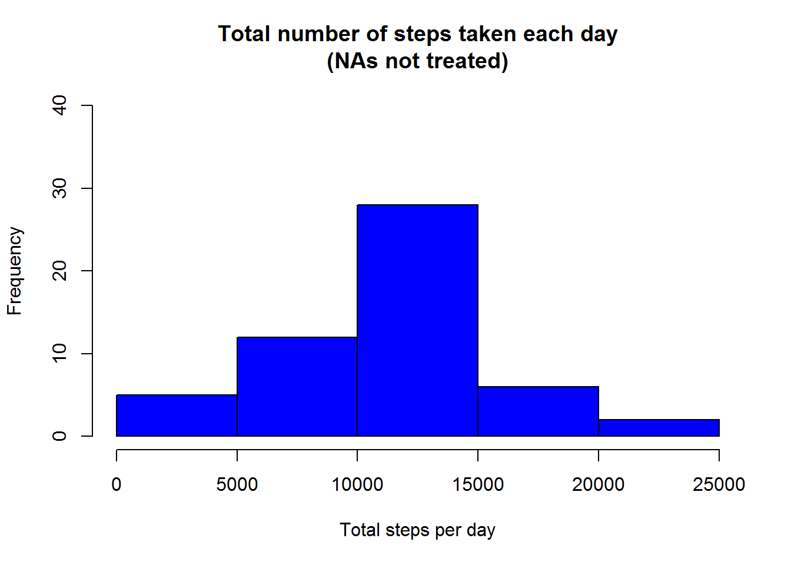

  
##Contents  
This document covers the following assignment aspects:  
1. Code for reading in the dataset and/or processing the data  
2. Histogram of the total number of steps taken each day  
3. Mean and median number of steps taken each day  
4. Time series plot of the average number of steps taken  
5. The 5-minute interval that, on average, contains the maximum number of steps  
6. Code to describe and show a strategy for imputing missing data  
7. Histogram of the total number of steps taken each day after missing values are imputed  
8. Panel plot comparing the average number of steps taken per 5-minute interval across weekdays and weekends  


## Code for reading in the dataset and/or processing the data

The following chunk of code ensure the file with activity records is available 
 (if yet not here) and the activity data are read into the 
data table for further analysis


```r
if (!file.exists("activity.csv")) {
     if (!file.exists("activity.zip")) {
         fil <- download.file("https://d396qusza40orc.cloudfront.net/repdata%2Fdata%2Factivity.zip", destfile = "activity.zip", mode = "wb")
         unzip("activity.zip")
     } 
     else { unzip("activity.zip") }
}
if(!dir.exists("figure")) dir.create("figure")

library(data.table)
activity <- data.table(read.csv("activity.csv",colClasses = c("numeric","Date","numeric")))
```

```r
head(activity)
```

```
##    steps       date interval
## 1:    NA 2012-10-01        0
## 2:    NA 2012-10-01        5
## 3:    NA 2012-10-01       10
## 4:    NA 2012-10-01       15
## 5:    NA 2012-10-01       20
## 6:    NA 2012-10-01       25
```

```r
summary(activity)
```

```
##      steps             date               interval     
##  Min.   :  0.00   Min.   :2012-10-01   Min.   :   0.0  
##  1st Qu.:  0.00   1st Qu.:2012-10-16   1st Qu.: 588.8  
##  Median :  0.00   Median :2012-10-31   Median :1177.5  
##  Mean   : 37.38   Mean   :2012-10-31   Mean   :1177.5  
##  3rd Qu.: 12.00   3rd Qu.:2012-11-15   3rd Qu.:1766.2  
##  Max.   :806.00   Max.   :2012-11-30   Max.   :2355.0  
##  NA's   :2304
```

```r
str(activity)
```

```
## Classes 'data.table' and 'data.frame':	17568 obs. of  3 variables:
##  $ steps   : num  NA NA NA NA NA NA NA NA NA NA ...
##  $ date    : Date, format: "2012-10-01" "2012-10-01" ...
##  $ interval: num  0 5 10 15 20 25 30 35 40 45 ...
##  - attr(*, ".internal.selfref")=<externalptr>
```
So, about a sixth part of step measurements is not available in the data set.  

## Histogram of the total number of steps taken each day
First we are summarizing the data by date for the following steps.


```r
library(dplyr, verbose = FALSE, quietly = TRUE)
activity_summarized <- activity%>%group_by(date)%>%summarize(SumSteps = sum(steps), MeanSteps = mean(steps), MedianSteps = median(steps))
head(activity_summarized)
```

```
##         date SumSteps MeanSteps MedianSteps
## 1 2012-10-01       NA        NA          NA
## 2 2012-10-02      126   0.43750           0
## 3 2012-10-03    11352  39.41667           0
## 4 2012-10-04    12116  42.06944           0
## 5 2012-10-05    13294  46.15972           0
## 6 2012-10-06    15420  53.54167           0
```
Generating the historgram (although the sums are for each day, the days itself are not represented in the figure, only the distribution of the sums).

```r
hist(activity_summarized$SumSteps, main = "Total number of steps taken each day\n(NAs not treated)", xlab = "Total steps per day", col = "blue", ylim = c(0,40))
```



```r
#Saving the figure for further recycling
dev.copy(png, file = "figure/Total_number_steps_with_NA.png")
```

```
## png 
##   5
```

```r
dev.off()
```

```
## RStudioGD 
##         2
```

## Mean and median number of steps taken each day  
Using the before summarized data print the mean and median number of steps taken each day

```r
mean(activity_summarized$SumSteps,na.rm = TRUE)
```

```
## [1] 10766.19
```

```r
median(activity_summarized$SumSteps,na.rm = TRUE)
```

```
## [1] 10765
```

```r
#For  comparisons in future...
activity_summarized_before <- copy(activity_summarized)
```
##Time series plot of the average number of steps taken or What is the average daily activity pattern?

```r
activity_summarized_interval <- aggregate(steps ~ interval, activity, mean)    
plot(x = activity_summarized_interval$interval, y = activity_summarized_interval$steps, type="l", xlab = "Interval", ylab = "Number of steps, avg." , main = "Average daily activity pattern", lwd = 2, col = "red")
```


## The 5-minute interval that, on average, contains the maximum number of steps


```r
with(activity_summarized_interval,interval[which.max(steps)])
```

```
## [1] 835
```
So, the time of the peak activity is on average about 8:35 AM

## Code to describe and show a strategy for imputing missing data

###Calculate and report the total number of missing values in the dataset (i.e. the total number of rows with NAs)

```r
sapply(activity, function(x) sum(is.na(x)))
```

```
##    steps     date interval 
##     2304        0        0
```
So, the total number of rows with NAs is 2304 (all missing values are in the column "steps")  

###Devising a strategy for filling in all of the missing values in the dataset.
Out of all unsophisticated strategies we choose here setting up the mean for the same 5-minute interval (over all the days) instead of the missing value

```r
#NB! Data tables are approached by reference, so copy() here to preserve the original data
activity_completed <- copy(activity)
#Calculating the mean values per interval, indexing (setkey)
activity_summarized <- aggregate(steps ~ interval, activity_completed, mean)
colnames(activity_summarized) <- c("interval","steps")
activity_summarized <- as.data.table(activity_summarized)
activity_summarized$interval <- as.factor(activity_summarized$interval)
setkey(activity_summarized,interval)

#Setting the appropriate mean values at the place of NAs
for (i in seq(along = activity_completed$steps)) {
    if (is.na(activity_completed[i,]$steps)) {
        intrv <- as.character(activity_completed[i,]$interval)
        activity_completed[i,]$steps <- activity_summarized[as.character(intrv)]$steps
    }
}
```
Compare

```r
identical(activity,activity_completed)
```

```
## [1] FALSE
```

```r
summary(activity)
```

```
##      steps             date               interval     
##  Min.   :  0.00   Min.   :2012-10-01   Min.   :   0.0  
##  1st Qu.:  0.00   1st Qu.:2012-10-16   1st Qu.: 588.8  
##  Median :  0.00   Median :2012-10-31   Median :1177.5  
##  Mean   : 37.38   Mean   :2012-10-31   Mean   :1177.5  
##  3rd Qu.: 12.00   3rd Qu.:2012-11-15   3rd Qu.:1766.2  
##  Max.   :806.00   Max.   :2012-11-30   Max.   :2355.0  
##  NA's   :2304
```

```r
summary(activity_completed)
```

```
##      steps             date               interval     
##  Min.   :  0.00   Min.   :2012-10-01   Min.   :   0.0  
##  1st Qu.:  0.00   1st Qu.:2012-10-16   1st Qu.: 588.8  
##  Median :  0.00   Median :2012-10-31   Median :1177.5  
##  Mean   : 37.38   Mean   :2012-10-31   Mean   :1177.5  
##  3rd Qu.: 27.00   3rd Qu.:2012-11-15   3rd Qu.:1766.2  
##  Max.   :806.00   Max.   :2012-11-30   Max.   :2355.0
```

## Histogram of the total number of steps taken each day after missing values are imputed
Computing the summarized statistics over the completed values

```r
activity_summarized <- activity_completed%>%group_by(date)%>%summarize(SumSteps = sum(steps, na.rm = TRUE), MeanSteps = mean(steps, na.rm = TRUE), MedianSteps = median(steps, na.rm = TRUE))
activity_summarized
```

```
## Source: local data table [61 x 4]
## 
##          date SumSteps MeanSteps MedianSteps
##        (date)    (dbl)     (dbl)       (dbl)
## 1  2012-10-01 10766.19  37.38260    34.11321
## 2  2012-10-02   126.00   0.43750     0.00000
## 3  2012-10-03 11352.00  39.41667     0.00000
## 4  2012-10-04 12116.00  42.06944     0.00000
## 5  2012-10-05 13294.00  46.15972     0.00000
## 6  2012-10-06 15420.00  53.54167     0.00000
## 7  2012-10-07 11015.00  38.24653     0.00000
## 8  2012-10-08 10766.19  37.38260    34.11321
## 9  2012-10-09 12811.00  44.48264     0.00000
## 10 2012-10-10  9900.00  34.37500     0.00000
## ..        ...      ...       ...         ...
```

```r
hist(activity_summarized$SumSteps, main = "Total number of steps taken each day\n(NAs substituted with means across an interval)", xlab = "Total steps per day", col = "blue", ylim = c(0,40))  
```


Do these values differ from the estimates from the first part of the assignment?
Anyway!


```r
summary(activity_summarized_before)
```

```
##       date               SumSteps       MeanSteps        MedianSteps
##  Min.   :2012-10-01   Min.   :   41   Min.   : 0.1424   Min.   :0   
##  1st Qu.:2012-10-16   1st Qu.: 8841   1st Qu.:30.6979   1st Qu.:0   
##  Median :2012-10-31   Median :10765   Median :37.3785   Median :0   
##  Mean   :2012-10-31   Mean   :10766   Mean   :37.3826   Mean   :0   
##  3rd Qu.:2012-11-15   3rd Qu.:13294   3rd Qu.:46.1597   3rd Qu.:0   
##  Max.   :2012-11-30   Max.   :21194   Max.   :73.5903   Max.   :0   
##                       NA's   :8       NA's   :8         NA's   :8
```

```r
summary(activity_summarized)
```

```
##       date               SumSteps       MeanSteps        MedianSteps    
##  Min.   :2012-10-01   Min.   :   41   Min.   : 0.1424   Min.   : 0.000  
##  1st Qu.:2012-10-16   1st Qu.: 9819   1st Qu.:34.0938   1st Qu.: 0.000  
##  Median :2012-10-31   Median :10766   Median :37.3826   Median : 0.000  
##  Mean   :2012-10-31   Mean   :10766   Mean   :37.3826   Mean   : 4.474  
##  3rd Qu.:2012-11-15   3rd Qu.:12811   3rd Qu.:44.4826   3rd Qu.: 0.000  
##  Max.   :2012-11-30   Max.   :21194   Max.   :73.5903   Max.   :34.113
```
  

##What is the impact of imputing missing data on the estimates of the total daily number of steps?


```r
    par(mfrow=c(1,2))
    hist(activity_summarized_before$SumSteps, main = "Total number of steps taken each day\n(NAs not treated)", xlab = "Total steps per day", col = "blue", ylim = c(0,40))
    hist(activity_summarized$SumSteps, main = "Total number of steps\n(NAs substituted)", xlab = "Total steps per day", col = "blue", ylim = c(0,40))
```


Visually, the peak interval of 10000 to 15000 steps per day has been enhanced through the imputing missing data.

## Panel plot comparing the average number of steps taken per 5-minute interval across weekdays and weekends


```r
activity_completed$weekend <- "weekday"
#Dont worry, pattern "So" is for german "Sonntag" (Sunday)
weekendindx <- grep("Su|Sa|So",weekdays(activity_completed$date, abbreviate = TRUE))
activity_completed[weekendindx,]$weekend <- "weekend"
activity_summarized <- aggregate(activity_completed$steps, by = list(activity_completed$weekend , activity_completed$interval), mean)

library(lattice)
xyplot(x ~  Group.2| Group.1, data = activity_summarized, type = "l", layout = c(1, 2), lty=1, xlab = "Interval", ylab = "Number of steps")
```


  
The daily pattern on weekends looks more uniform than  on weekdays (definite  morning peaks).
